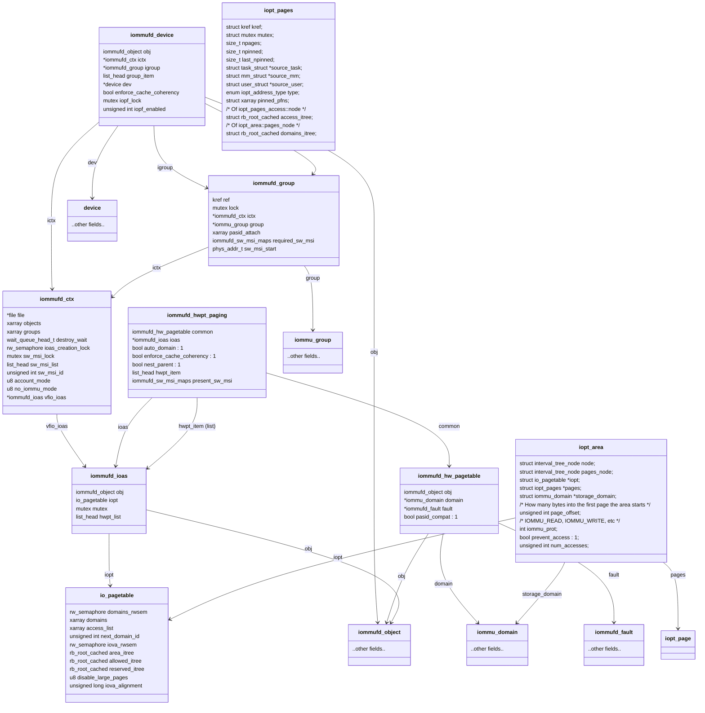

# IOMMUFD Structs Diagram

```mermaid
classDiagram
    class iommufd_ctx {
        *file file
        xarray objects
        xarray groups
        wait_queue_head_t destroy_wait
        rw_semaphore ioas_creation_lock
        mutex sw_msi_lock
        list_head sw_msi_list
        unsigned int sw_msi_id
        u8 account_mode
        u8 no_iommu_mode
        *iommufd_ioas vfio_ioas
    }

    class iommufd_device {
        iommufd_object obj
        *iommufd_ctx ictx
        *iommufd_group igroup
        list_head group_item
        *device dev
        bool enforce_cache_coherency
        mutex iopf_lock
        unsigned int iopf_enabled
    }

    class iommufd_group {
        kref ref
        mutex lock
        *iommufd_ctx ictx
        *iommu_group group
        xarray pasid_attach
        iommufd_sw_msi_maps required_sw_msi
        phys_addr_t sw_msi_start
    }

    class iommufd_hw_pagetable {
        iommufd_object obj
        *iommu_domain domain
        *iommufd_fault fault
        bool pasid_compat : 1
    }

    class iommufd_hwpt_paging {
        iommufd_hw_pagetable common
        *iommufd_ioas ioas
        bool auto_domain : 1
        bool enforce_cache_coherency : 1
        bool nest_parent : 1
        list_head hwpt_item
        iommufd_sw_msi_maps present_sw_msi
    }

    class iommufd_ioas {
        iommufd_object obj
        io_pagetable iopt
        mutex mutex
        list_head hwpt_list
    }

    class iopt_area {
        struct interval_tree_node node;
        struct interval_tree_node pages_node;
        struct io_pagetable *iopt;
        struct iopt_pages *pages;
        struct iommu_domain *storage_domain;
        /* How many bytes into the first page the area starts */
        unsigned int page_offset;
        /* IOMMU_READ, IOMMU_WRITE, etc */
        int iommu_prot;
        bool prevent_access : 1;
        unsigned int num_accesses;
    }
    
    class io_pagetable {
        rw_semaphore domains_rwsem
        xarray domains
        xarray access_list
        unsigned int next_domain_id
        rw_semaphore iova_rwsem
        rb_root_cached area_itree
        rb_root_cached allowed_itree
        rb_root_cached reserved_itree
        u8 disable_large_pages
        unsigned long iova_alignment
    }

    class iopt_pages {
        struct kref kref;
        struct mutex mutex;
        size_t npages;
        size_t npinned;
        size_t last_npinned;
        struct task_struct *source_task;
        struct mm_struct *source_mm;
        struct user_struct *source_user;
        enum iopt_address_type type;

        struct xarray pinned_pfns;
        /* Of iopt_pages_access::node */
        struct rb_root_cached access_itree;
        /* Of iopt_area::pages_node */
        struct rb_root_cached domains_itree;
    }

    class device {
        ..other fields..
    }

    class iommu_group {
        ..other fields..
    }

    class iommu_domain {
        ..other fields..
    }

    class iommufd_fault {
        ..other fields..
    }

    class iommufd_object {
        ..other fields..
    }

    iommufd_ctx --> iommufd_ioas : vfio_ioas
    iommufd_device --> iommufd_ctx : ictx
    iommufd_device --> iommufd_group : igroup
    iommufd_device --> iommufd_group : group_item (list)
    iommufd_device --> device : dev
    iommufd_group --> iommufd_ctx : ictx
    iommufd_group --> iommu_group : group
    iommufd_hw_pagetable --> iommu_domain : domain
    iommufd_hw_pagetable --> iommufd_fault : fault
    iommufd_hwpt_paging --> iommufd_hw_pagetable : common
    iommufd_hwpt_paging --> iommufd_ioas : ioas
    iommufd_hwpt_paging --> iommufd_ioas : hwpt_item (list)
    iommufd_ioas --> io_pagetable : iopt
    iommufd_device --> iommufd_object : obj
    iommufd_hw_pagetable --> iommufd_object : obj
    iommufd_ioas --> iommufd_object : obj
    iopt_area --> io_pagetable : iopt
    iopt_area -->iopt_page : pages
    iopt_area -->iommu_domain :storage_domain
```